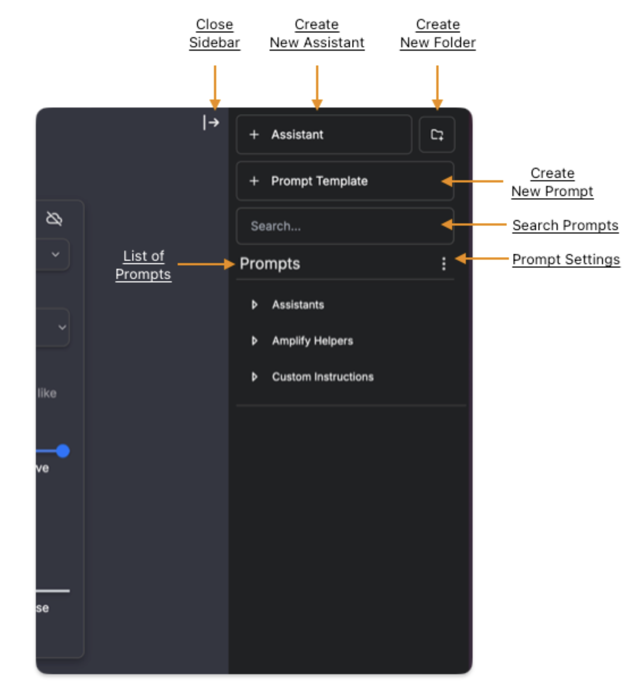
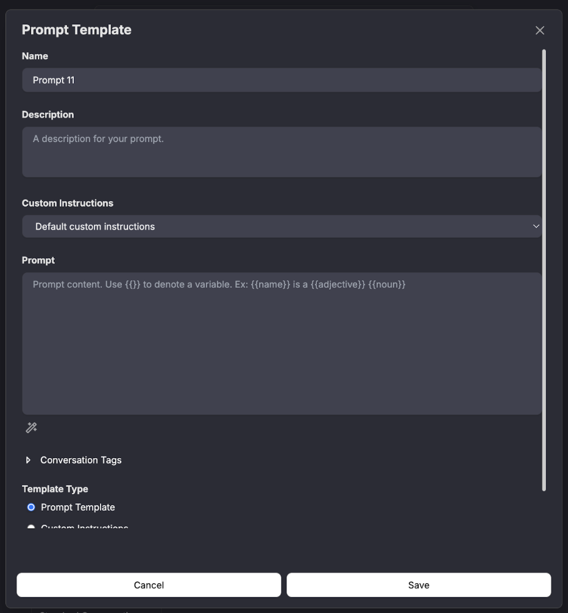
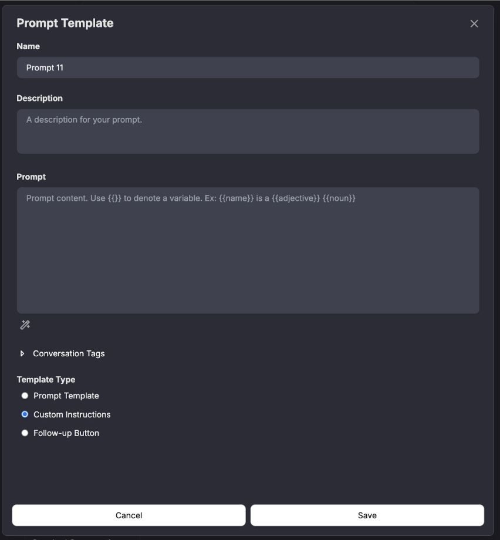
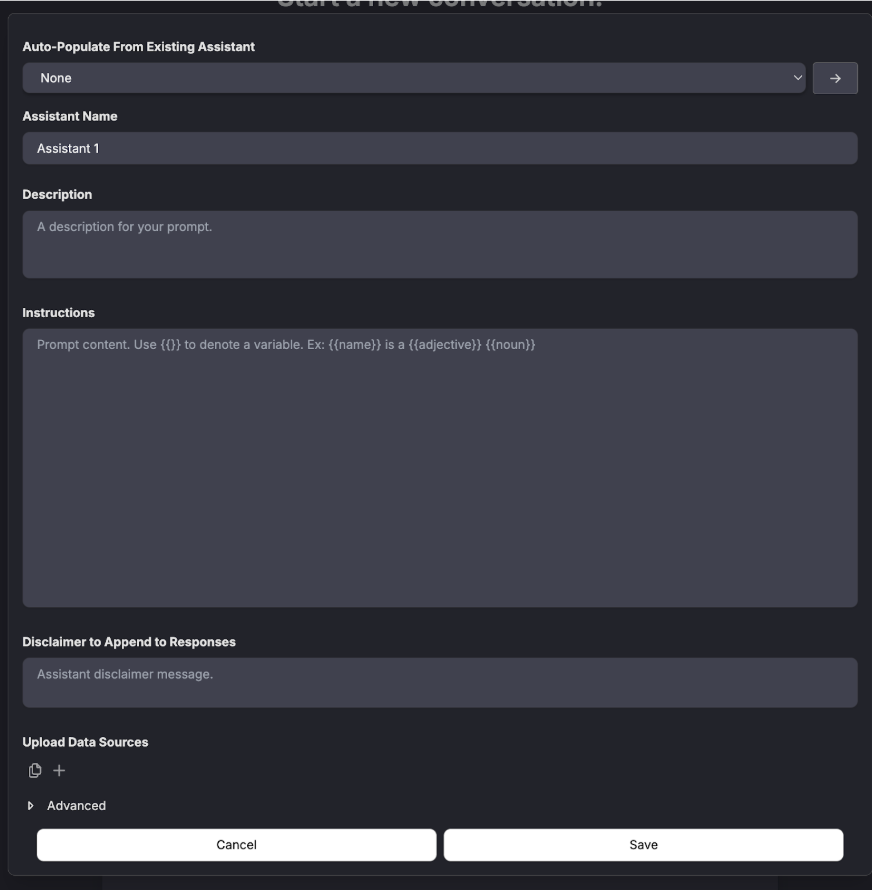

# Assistants, Prompt Templates, & Instructions

The **Prompts Sidebar** in Amplify allows you to manage and organize AI prompts, assistants, and custom instructions for streamlined interactions.

**Key Features**

* **Close Sidebar:** Collapse the sidebar to maximize workspace.
* **Create New Assistant:** Add a pre-configured AI assistant to your chats.
* **Create New Folder:** Organize prompts into custom folders.
* **Create New Prompt Template:** Define a reusable prompt for consistency.
* **Search Prompts:** Quickly find saved prompts.
* **Prompt Settings:** Access additional options for managing your prompts.
* **List of Prompts:** View and organize available prompts, including:
    * **Assistants** – Pre-configured AI assistants.
    * **Amplify Helpers** – System-provided tools for specific tasks.
    * **Custom Instructions** – User-defined AI behavior settings.

This sidebar helps streamline workflows by making it easy to create, organize, and access AI-driven prompts and assistants. For more information on Assistants, Prompts, and how to make them please refer to our next section

## Overview

In Amplify, AI interactions are structured using **prompts, custom instructions, and assistants**, each serving a different role in guiding responses and behavior.

**Prompts**

A **prompt** is an input or request given to the AI to generate a response. Prompts can be simple questions or structured templates for consistency in responses.

* *Example: "Summarize this document in three bullet points."*

**Custom Instructions**

**Custom instructions** define AI behavior, shaping how it responds across different interactions. These settings influence tone, response style, and output preferences.

* *Example: "Always provide explanations in a concise and professional manner."*

**Assistants**

An **assistant** is a pre-configured AI model tailored for specific tasks or workflows. Assistants can incorporate prompts and custom instructions to function as specialized tools for reporting, analysis, or guidance.

* *Example*: A **Data Insights Assistant** designed to analyze and summarize survey results.

These tools allow users to fine-tune AI interactions, ensuring responses are relevant, structured, and aligned with specific needs.

## Creating Prompt Templates

Prompt templates in Amplify allow users to create reusable AI prompts for consistent interactions. Follow these steps to configure a Prompt Template using the setup form.

### Steps to Create a Prompt Template

* **Name**
    * Enter a descriptive name for your prompt template.
    * *Example: Lesson Plan Generator*
* **Description (Optional)**
    * Provide a brief overview of the prompt's purpose.
    * *Example: "Generates a structured lesson plan based on a topic and learning objectives."*
* **Custom Instructions**
    * Choose predefined AI behavior settings or leave it as **Default custom instructions** for standard interactions.
    * *Example: "Provide responses in an academic style with structured formatting."*
* **Prompt**
    * Define the core instruction that the AI will follow.
    * Use **{{}} placeholders** for dynamic variables.
    * *Example: "Create a {{lesson_plan}} for {{grade_level}} students covering {{topic}}."*
* **Conversation Tags (Optional)**
    * Assign tags to categorize and filter this prompt for easy retrieval.
**Template Type**
    * Select Prompt Template (default) or switch to Custom Instructions if defining AI behavior instead.
* **Save or Cancel**
    * Click **Save** to finalize the template for future use.
    * Click **Cancel** to discard changes.

Once saved, the prompt template will be available in the **Prompts Sidebar**, ready for quick access and reuse in conversations.

## Creating Custom Instructions

Custom Instructions in Amplify allow users to define how the AI behaves across interactions. These settings shape response tone, structure, and decision-making.

### Steps to Create a Prompt Template
* **Name**
    * Enter a descriptive name for the custom instructions.
    * Example: Formal Research Assistant
* **Description (Optional)**
    * Provide a brief overview of the instructions’ purpose.
    * Example: "Ensures responses follow an academic tone with well-structured citations."
* **Prompt**
    * Define specific behavior or response patterns the AI should follow.
    * Use **{{}} placeholders** for dynamic inputs.
    * *Example: "Respond in a formal and structured manner. When citing sources, use APA formatting. Ensure responses are concise but informative."*
* **Conversation Tags (Optional)**
    * Assign tags to categorize and filter this instruction for easy retrieval.
* **Template Type**
    * **Custom Instructions (default)** – Defines AI behavior for specific use cases.
    * **Prompt Template** – If selected, the AI follows a predefined structured prompt instead.
    * **Follow-up Button** – Allows users to create quick-action buttons for follow-up interactions.
* **Save or Cancel**
    * Click **Save** to apply the custom instruction for future use.
    * Click **Cancel** to discard changes.

Once saved, the custom instruction will be available in the **Prompts Sidebar** and can be applied to conversations as needed.

## Creating Your Own Assistant

Amplify allows you to create custom AI Assistants to automate tasks, provide structured responses, and enhance workflow efficiency. Follow these steps to configure your assistant using the setup form.

### Steps to Create an AI Assistant

* **Auto-Populate from Existing Assistant (Optional)**
    * If you want to base your new assistant on a previously created one, select it from the dropdown.
    * Otherwise, leave it set to None to start from scratch.
* **Assistant Name**
    * Enter a descriptive name for your assistant.
    * This helps differentiate it from other assistants in your workspace.
* **Description (Optional)**
    * Provide a short overview of the assistant’s purpose.
    * *Example: “A reporting assistant that summarizes survey responses.”*
* **Instructions**
    * Define how the assistant should respond and behave.
    * Use {{}} brackets to create dynamic variables.
    * *Example: "Summarize the key insights from {{report_name}} in three bullet points."*
* **Disclaimer to Append to Responses (Optional)**
    * Add a disclaimer message that will appear at the end of every response.
    * Useful for clarifying AI-generated content or legal notices.
* **Upload Data Sources (Optional)**
    * Attach relevant files or datasets that the assistant should reference.
* **Advanced Settings (Optional)**
    * Expand this section for additional configuration options.
* **Save or Cancel**
    * Click **Save** to finalize the assistant.
    * Click **Cancel** to discard changes.

Once saved, your assistant will be available in the **Prompts Sidebar** for use in conversations.

*Example:*

*"You are an AI assistant that helps educators create structured lesson plans. Given a topic, learning objectives, and teaching style, generate a detailed plan that includes:*

* *An engaging introduction (hook)*
* *Key concepts and explanations*
* *Interactive activities or exercises*
* *Assessment methods (quizzes, discussions, projects)*
* *Suggested materials and resources*

*Ensure the plan is clear, adaptable, and follows best practices for student engagement. Use {{subject}} and {{grade_level}} to customize the response. Keep responses concise but informative."*

### Advanced Options
The **Advanced Options** section provides additional customization settings for AI assistants. These settings allow fine-tuned control over data sources, message formatting, and assistant capabilities.

#### URI & Assistant ID

* **URI:** Specify a unique identifier or endpoint for API integration.
* **Assistant ID:** Assign a custom identifier for tracking and managing assistants.

#### Data Source Options

These options determine how the assistant interacts with uploaded documents and conversation history.

* **Include Download Links for Referenced Documents:** Provides users with direct download links for documents used in responses.
* **Include Attached Documents in RAG (Retrieval-Augmented Generation):** Allows the assistant to reference attached documents for generating responses.
* **Include Attached Documents in Prompt:** Inserts document content directly into prompts for more context-aware responses.
* **Include Conversation Documents in RAG:** Enables retrieval of past conversation documents to inform responses.
* **Include Conversation Documents in Prompt:** Adds conversation documents directly into prompts for a more contextually aware assistant.
* **Include Attached Data Source Metadata in Prompt:** Embeds metadata (e.g., file name, date) from attached documents into prompts.
* **Include Conversation Data Source Metadata in Prompt:** Embeds metadata from past conversation documents.
* **Disable Data Source Insertion:** Prevents documents from being inserted into prompts automatically.

📌 *Use case*: Enabling **RAG** helps the assistant pull information from uploaded documents without inserting full text into prompts. If full document content is needed, select **Include Attached Documents in Prompt** instead.

#### Message Options

Controls formatting and additional details in user and assistant messages.

* **Include Message IDs in Messages:** Adds unique message IDs for tracking and debugging.
* **Insert Line Numbers in User Messages:** Displays line numbers for user input, useful for coding or structured text analysis.
* **Insert Line Numbers in Assistant Messages:** Displays line numbers in AI responses, making it easier to reference specific parts.

📌 *Use case*: Line numbers help with structured content like coding snippets or long-form documents, making responses easier to follow.

#### Feature Options

* **Allow Assistant to Create Artifacts:** Enables the assistant to generate and save files or structured outputs.

📌 *Use case*: If enabled, the assistant can create reports, summaries, or formatted outputs that users can download or reference later.

#### Tags & Conversation Tags

* **Tags:** Assign keywords to categorize and filter assistants.
* **Conversation Tags:** Apply tags to conversations involving this assistant for easier retrieval.

📌 *Use case*: Tagging helps users organize and search for assistants and conversations by topic or purpose.

#### Best Practices for Using Advanced Options

* Enable **RAG** for assistants that need document retrieval without inserting full text.
* Use **Metadata Options** to retain context without overwhelming prompts.
* Enable **Artifact Creation** for structured outputs like reports or summaries.
* Use **Tags & Conversation Tags** for better organization and searchability.

These advanced settings help tailor AI assistants for specific workflows and data needs.
