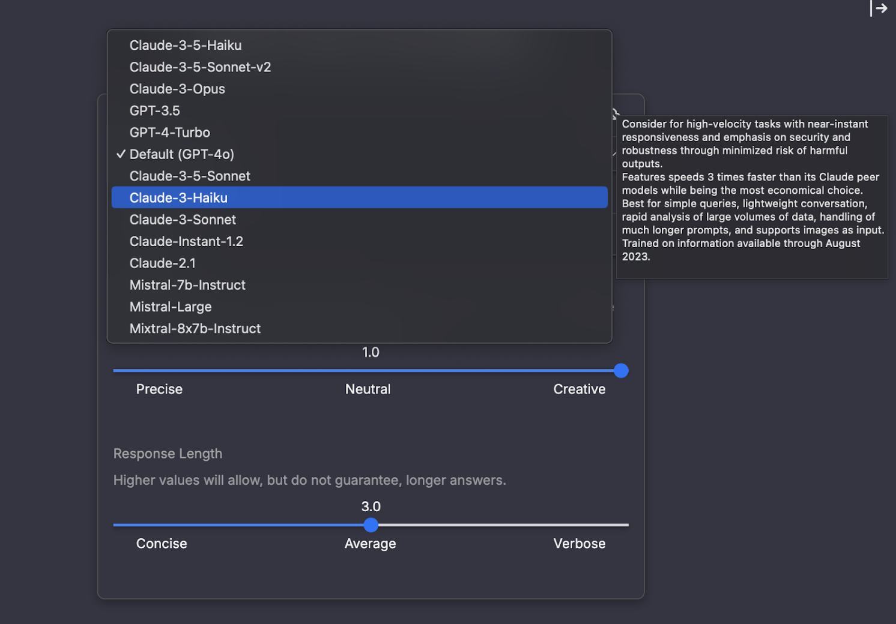

# Using the Chat Interface

## Start A New Conversation

### Select a Model
Choose the model you would like to use from the dropdown menu. The choices available to you, including your default option, will depend on which models your organization has set up.

For more tips on what model is best for what tasks you can hover your cursor over each option to view a tooltip overview of each one.

### Custom Instructions
Custom instructions in AI refer to predefined guidelines or parameters that shape how an AI system behaves, responds to user inputs, and processes information. For more information on how this works and where you can create your own instructions please refer to our Creating Custom Instructions section.

### Temperature & Response Length
When starting a new conversation in Amplify, you can adjust the **Temperature** and** Response Length** settings to control how the AI generates responses.
* **Temperature (0.0 – 1.0):** Adjusts creativity and variability in responses.
    * **0.0 (Precise):** The AI provides factual, predictable answers with minimal variation.
    * **0.5 (Neutral):** Balances accuracy with some flexibility in wording.
    * **1.0 (Creative):** Allows more open-ended, varied responses, useful for brainstorming.
* **Response Length (0.0 – 6.0):** Controls how detailed the AI’s responses are.
    *** 0.0 (Concise):** Short, to-the-point answers.
    * **3.0 (Average):** Balanced detail with key information included.
    * **6.0 (Verbose):** Longer, in-depth explanations.

These settings let you fine-tune AI responses to match your needs, whether you want direct answers or more exploratory discussions.

### Adding Existing & New Media
In Amplify, you can enhance your conversations by attaching media files. There are two options:
* **Add New Media:** Upload a file directly from your device by opening your local file explorer.
* **Add Existing Media:** Select from previously uploaded files, including documents, slides, and other media.

This feature allows you to seamlessly integrate relevant materials into your discussions for better collaboration and reference.

### Adding An Assistant
You can add a **pre-made AI assistant** to enhance your chat experience.

* **What is an AI Assistant?**
    * An AI assistant is a specialized model designed to provide tailored responses, insights, or guidance based on its configured expertise.
* **What does it do?**
    * When added to a conversation, the assistant will analyze context, answer questions, and assist with tasks based on its specific role—whether that’s summarizing data, generating content, or offering technical support.

This feature helps streamline discussions by bringing in expert AI guidance as needed. For more information about how to create an assistant please refer to the Creating An Assistant section.

### Message Input & Sending Your Message
Once you have your setting where you want them you can type your message into the chat box at the bottom of the screen. When you are done you can hit the send button to submit it to the AI.