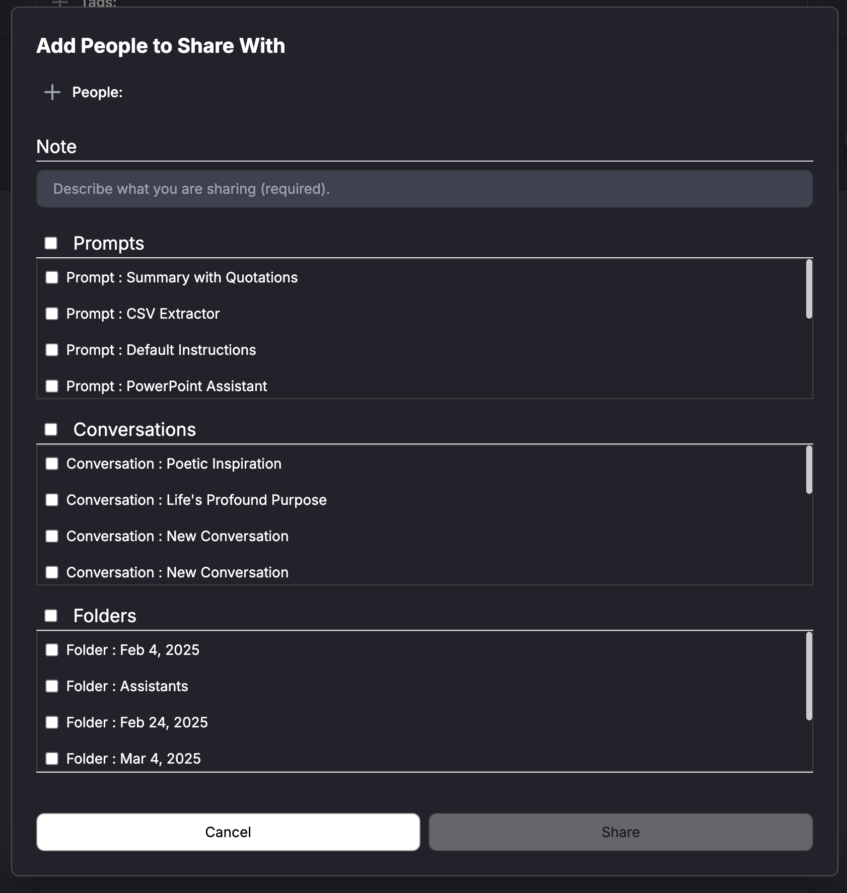

# Sharing Conversations, Prompts, and Folders in Amplify

Amplify allows users to share prompts, conversations, and folders with others, facilitating collaboration and knowledge exchange within an organization.

## How to Share Items in Amplify

* **Open the Sharing Panel**
    * Locate the Share view in the left side panel.
    * Click "Share With Other People" to open the above window.
* **Add People**
    * Click "People" to select or enter the names/emails of the users you want to share with.
* **Add a Note (Optional, but Recommended)**
    * In the "Note" section, describe what you're sharing and any relevant details for the recipients.
* **Select Items to Share**
    * Choose from three categories:
        * **Prompts** – Share AI prompts such as templates, extractors, or predefined instructions.
        * **Conversations** – Share past AI interactions to provide context or reference materials.
        * **Folders** – Share entire groups of related conversations and prompts for better organization.
* **Confirm and Share**
    * Click "Share" to complete the process.
    * The selected users will now have access to the shared items.

## Best Practices for Sharing

✔ Use descriptive notes to clarify the purpose of shared content.

✔ Organize items in folders before sharing to keep resources structured.

✔ Ensure permissions align with data sensitivity when sharing conversations.

This feature makes it easy to collaborate by providing access to relevant AI interactions, prebuilt prompts, and structured folders in Amplify.