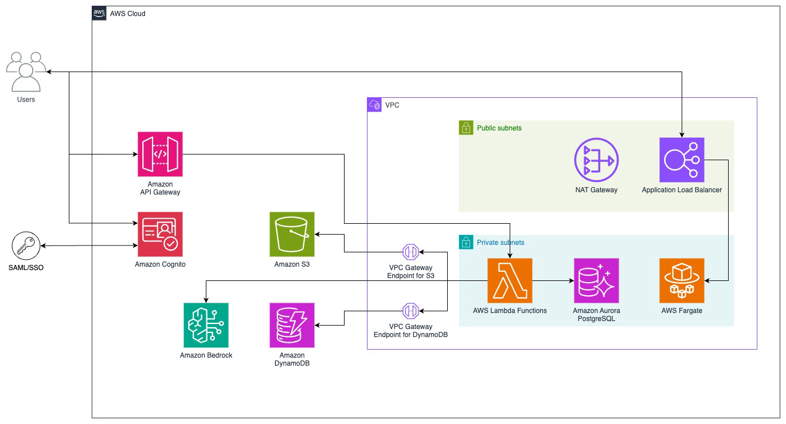

# Amplify

## Overview of Amplify

Amplify is Vanderbilt University's open-source enterprise platform for generative AI, designed to empower organizations with the ability to innovate across disciplines. By offering a flexible and cost-efficient chat-based interface, Amplify allows users to experiment with and deploy generative AI solutions tailored to their specific needs. Its architecture supports vendor independence, ensuring that users can select and switch between a variety of AI models, such as those from OpenAI and Anthropic, without being locked into a single provider.

## Key Use Cases

Amplify has been deployed in diverse contexts, including:
* **Higher Education**: Streamlining content creation, such as generating quizzes, study guides, or visual aids for lectures.
* **Administrative Operations**: Automating tasks like policy summarization and contract review to improve efficiency.
* **Cross-Disciplinary Research**: Enabling teams from various fields to experiment with generative AI applications, such as data visualization or text generation, while maintaining control over their data.
Amplify’s customization options, such as creating reusable templates and domain-specific assistants, make it an adaptable tool for institutional needs.

## Open-Source Advantage

As an open-source platform, Amplify offers the following benefits:
* **Modification**: Users can tailor the platform to suit unique requirements.
* **Accessibility**: Organizations can deploy Amplify in their own AWS environments, reducing dependency on external providers.
* **Community-Driven Improvements**: Amplify’s open-source model fosters a collaborative ecosystem where users can contribute enhancements and share best practices.

---

# Getting Started With Amplify

## Architecture

<a href="Amplify_GenAI_Diag.png" target="_blank">
  
</a>

## System Requirements
To deploy and operate Amplify, the following system prerequisites are recommended:
* **Hardware/Software Requirements**:
  * AWS account with appropriate IAM permissions
  * Terraform installed and configured
  * Python 3.11, pip, and the Serverless Framework (version 3.38.0)
  * Docker installed and configured
  * Domain hosted in Amazon Route 53
* **Integration Requirements**:
  * Mixpanel account for analytics
  * Model access enabled in the AWS Bedrock console (for Anthropic or Mistral models)

## General Installation and Setup Overview

1. **Clone Repositories**

Clone the three required repositories—frontend, backend, and infrastructure—from the GitHub repository.

2. **Initialize and Apply Terraform**

Configure Terraform variables and initialize the environment with `terraform init`, followed by `terraform apply`.

3. **Set Up Backend Services**

* Configure and deploy the backend services using the Serverless Framework.
* Update environment variables with outputs from the Terraform deployment.

4. **Build and Deploy the Frontend**
* Build the Docker image from the frontend repository.
* Deploy the image to Amazon ECR and update ECS services.

5. **Finalize Configuration**
* Update secrets in AWS Secrets Manager for sensitive variables (e.g., API keys, client secrets).
* Upload and configure necessary files, such as base prompts and endpoints, in S3.

---
# How To Use Amplify

* [Using The Chat Interface](../docs/chat-interface.md)
* [Conversations View](../docs/conversation-view.md)
* [Sharing View](../docs/sharing-view.md)
* Workspace View [Deprecated]
* Assistants, Templates, and Instructions
* How To Share in Amplify
* Settings
* Examples of How To Use Amplify

---

## In Depth Deployment Steps

These are the deployment instructions to deploy Amplify-GenAI in your own AWS environment. This deployment will create many resources in your account. Please be aware that there are costs associated with deploying the following application.

### 1. Clone Repositories

- Clone all three repositories (`amplify-genai-frontend`, `amplify-genai-backend`, and `amplify-genai-iac`) from `https://github.com/gaiin-platform` into the same directory on your local machine.

### 2. Terraform Initialization and Application

- Navigate to the `amplify-genai-iac` project on your local machine.
- Configure the Terraform variables by copying the `amplify-genai-iac/<env>/terraform.tfvars_sample` file to `amplify-genai-iac/<env>/terraform.tfvars`.
- Update the `terraform.tfvars` file with the specific values for your deployment. You will need to configure the following variables:
  - Load balancing vars: `public_subnet_cidrs`, `private_subnet_cidrs`, `alb_name`, `domain_name`, `app_route53_zone_id`
  - Cognito vars: `cognito_domain`, `cognito_route53_zone_id`
  - ECS vars: `ecs_alarm_email`
- If this is the first time you are deploying, initialize your Terraform environment by running `terraform init`.
- Apply your Terraform configuration using `terraform apply`. Occassionally, you will see an "access denied" error when trying to apply a policy to a resource. You may need to run `terraform apply` again to correct this issue.

### 3. Configure Serverless Framework Variables

- After applying Terraform configurations, save the outputs from the Terraform state. These will be used in the variables needed for the Serverless Framework deployment.
- Create and configure a `amplify-genai-backend/var/<env>-var.yml` file using the values from the Terraform outputs. Use `amplify-genai-backend/<env>-var.yml-example` as a reference for the required format and variables. You will need to configure all variables in the `amplify-lambda` section. The reference sample includes comments to denote which variable from the Terraform outputs are to be used.

### 4. Backend Package Installation

- Install the necessary Serverless plugins by running the following commands in the `amplify-genai-backend` directory:

  ```sh
  npm install 
  ```


- For the JavaScript dependencies, navigate to the `amplify-genai-backend/amplify-lambda-js` directory and run `npm install` to install the necessary Node.js packages.

### 5. Deploy Serverless Backend Services

- To deploy the Python 3.11 backend services using the Serverless Framework, navigate to the `amplify-genai-backend` directory.
- Deploy all backend lambdas by running the following commands:

  ```sh

  serverless deploy --stage <env>

  ```

- If an individual service fails to deploy, and you cannot resolve the issue through the Serverless Framework, you may need to manually delete the associated CloudFormation stack from the AWS console before retrying the deployment.
- To deploy an individual service, execute:

  ```sh
 
  serverless <service-name>:deploy --stage <env>

  ```

- where `service-name` is the specific service key as defined in `serverless-compose.yml`.


### 6. Update Task Definition and Apply Terraform Configuration

After deploying the backend services, you will need to update certain variables in your Terraform (IAC) configuration:

- Obtain the following environment specific (e.g., `dev`, `prod`) variables from the deployed backend services and AWS Console:
  - `API_BASE_URL`: The base URL for your API endpoints. This should be the custom API domain within the API gateway console.
  - `CHAT_ENDPOINT`: The exported variable from the `amplify-js-<env>`` CloudFormation stack.
  - `COGNITO_CLIENT_ID`: Found in the App Client settings within the Cognito console on AWS.
  - `COGNITO_ISSUER`: The base URL for your Cognito user pool, found in the Cognito console on AWS.
  - `COGNITO_DOMAIN`: The custom Cognito domain, found in the App integration tab of the Cognito console on AWS.

- Update the `amplify-genai-iac/<env>/terraform.tfvars` file with the newly obtained values for the respective variables.

- Apply the updated Terraform configuration by running `terraform apply` within the `amplify-genai-iac/<env>` project directory.

Additionally, certain secrets must be updated manually in the AWS Secrets Manager or via AWS CLI:

- Navigate to the AWS Secrets Manager and locate the secret named `amplify-app-secrets`.
- Manually update the following secret values:
  - `COGNITO_CLIENT_SECRET`: Can be found in the App Client settings within the Cognito console in AWS.
  - `NEXTAUTH_SECRET`: Generate a new random secret for NextAuth.
  - `OPENAI_API_KEY`: Insert your OpenAI API Key.

### 7. Build and Deploy to ECR

- To build the container and deploy it to the service, follow these steps:
  - Authenticate to Amazon ECR using the AWS CLI. (For steps, visit Amazon ECR in the AWS Management Console, select the private repository, and click `View Push Commands`.)
  - Build the Docker image from the Frontend Repository directory using this command: 

    ```sh
    docker build -t <env>-<ecr_repo_name> .
    ```

  Replace `env` with the deployment environment, and `ecr_repo_name` is the name given in the `amplify-genai-iac/<env>/terraform.tfvars` file.

  - Tag the Docker image with the `latest` tag and a unique tag that includes the date and SHA digest of the image.
  - Push the Docker image to the Amazon ECR repository with the `docker push` command.
  - Update the ECS service to use the new Docker image by forcing a new deployment with the AWS CLI or via the AWS Management Console.

### 8. Configure S3, Secrets, and Azure Endpoints

- Upload the `amplify-genai-backend/misc_deployment_files/base.json` file to the `amplify-<deployment>-lambda-<env>-base-prompts` S3 bucket.
- Configure the `amplify-genai-backend/misc_deployment_files/endpoints.json` file with your Azure endpoints and associated keys. Update the AWS Secrets Manager secret titled `<env>-openai-endpoints`.

### 9. Clean Up

- After the deployment, remove any temporary files or secrets that were created during the process. This includes any local configuration files or sensitive information that should not be stored permanently.

## Notes

- Throughout the deployment process, ensure that you are in the correct directories when executing commands.
- Always verify the output of each command to ensure that there are no errors before proceeding to the next step.
- The `NEXTAUTH_SECRET` can be an arbitrary string.
- It is recommended to document the values of important variables and outputs for future reference and troubleshooting.
- Below are the currently supported models that Amplify can use. 
  
  #### Anthropic (via Amazon Bedrock)
    - `anthropic.claude-instant-v1`
    - `anthropic.claude-v2:1`
    - `us.anthropic.claude-3-5-sonnet-20241022-v2:0` This models use the Bedrock Inference Endpoints. Refer to this [link](https://docs.aws.amazon.com/bedrock/latest/userguide/inference-profiles-support.html "Bedrock Inference Regions") and deploy in the appropriate regions.
    - `anthropic.claude-3-5-sonnet-20240620-v1:0`
    - `anthropic.claude-3-sonnet-20240229-v1:0`
    - `us.anthropic.claude-3-5-haiku-20241022-v1:0` This models use the Bedrock Inference Endpoints. Refer to this [link](https://docs.aws.amazon.com/bedrock/latest/userguide/inference-profiles-support.html "Bedrock Inference Regions") and deploy in the appropriate regions. 
    - `anthropic.claude-3-haiku-20240307-v1:0`
    - `us.anthropic.claude-3-opus-20240229-v1:0` This models use the Bedrock Inference Endpoints. Refer to this [link](https://docs.aws.amazon.com/bedrock/latest/userguide/inference-profiles-support.html "Bedrock Inference Regions") and deploy in the appropriate regions.
  

  #### OpenAI (via OpenAI or Azure)
    - `gpt-35-turbo`
    - `gpt-4o`
    - `gpt-4-1106-Preview`
  
  #### Mistral (via Amazon Bedrock)
    - `mistral.mistral-7b-instruct-v0:2`
    - `mistral.mixtral-8x7b-instruct-v0:1`
    - `mistral.mistral-large-2402-v1:0`

  Populate `AVAILABLE_MODELS` with a comma-delimited list of the supported models you wish to make available. To use the Anthropic or Mistral models, you will need to enable them in your AWS account and then update the `AVAILABLE_MODELS` environment variable in the `amplify-genai-iac` project and run `terraform apply`. For Bedrock models, please ensure you have requested access in the appropriate regions. 

  Example:
  ```
  AVAILABLE_MODELS='gpt-35-turbo,gpt-4o,gpt-4-1106-Preview,anthropic.claude-instant-v1,anthropic.claude-v2:1,anthropic.claude-3-5-sonnet-20240620-v1:0,anthropic.claude-3-sonnet-20240229-v1:0,anthropic.claude-3-haiku-20240307-v1:0,anthropic.claude-3-opus-20240229-v1:0,mistral.mistral-7b-instruct-v0:2,mistral.mixtral-8x7b-instruct-v0:1,mistral.mistral-large-2402-v1:0'
  ```

  After the `AVAILABLE_MODELS` environment variable has been updated, you will need to redeploy the AWS ECS service.

- Ensure `DEFAULT_MODEL` is a model listed within `AVAILABLE_MODELS`.
- If you have any questions or encounter issues during the deployment process, please email amplify@vanderbilt.edu for assistance.

Copyright (c) 2024 Vanderbilt University  
Authors: Jules White, Allen Karns, Karely Rodriguez, Max Moundas
Contributions: Jason Bradley, Kai Xu
